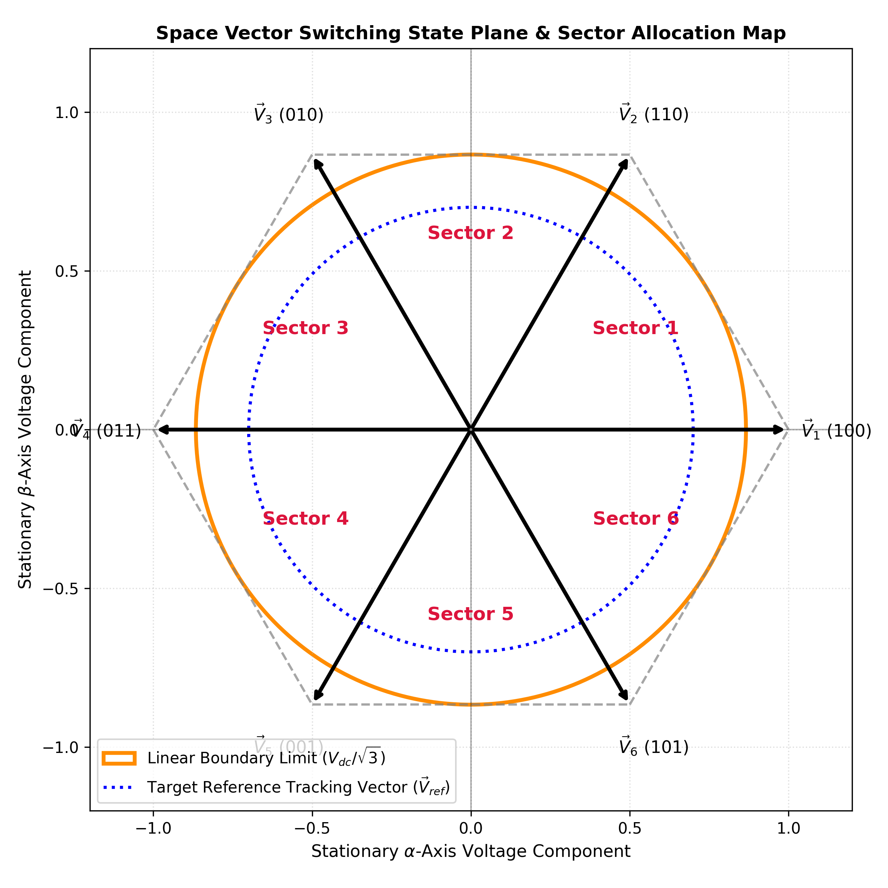
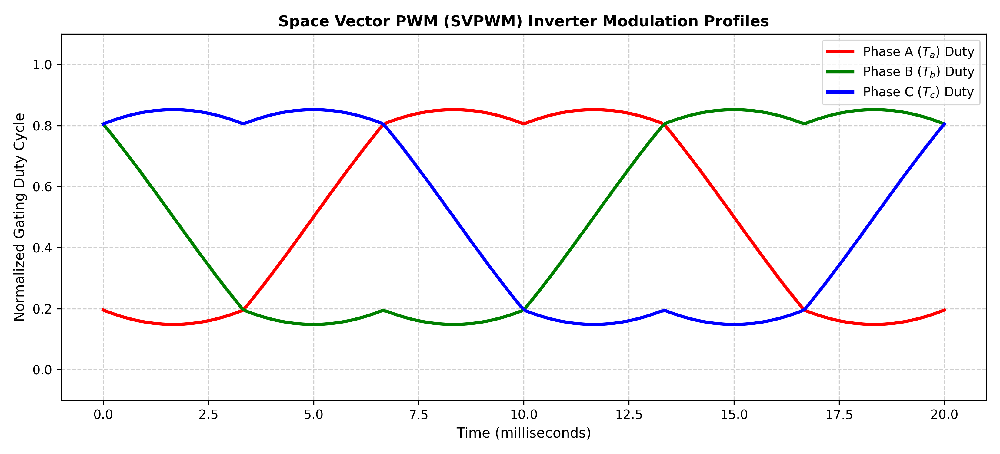

# Grid-Tied Three-Phase Inverter with Space Vector PWM (SVPWM)

## 📌 Project Overview
This repository features a complete mathematical and behavioral simulation engine of a grid-tied three-phase DC-AC power inverter written entirely in Python. In high-efficiency renewable energy integration and industrial motor drives, traditional Sinusoidal PWM (SPWM) is limited by poor DC-bus voltage utilization and higher harmonic content. 

To overcome these constraints, this project implements a custom **Space Vector Pulse Width Modulation (SVPWM)** algorithm. By mapping three-phase variables onto a rotating two-dimensional voltage vector plane, the control engine maximizes DC-bus utilization by $15.5\%$ and significantly suppresses Total Harmonic Distortion (THD) to meet strict international grid compliance standards (IEEE 519).

---

## 📊 System Design Parameters

### 1. Power Stage & Grid Specifications
| Parameter | Symbol | Target Value |
| :--- | :--- | :--- |
| **DC Bus Voltage** | $V_{dc}$ | 800 V |
| **Grid Line-to-Line Voltage (RMS)** | $V_{grid\_rms}$ | 400 V |
| **Grid Frequency** | $f_{grid}$ | 50 Hz |
| **Switching & Sampling Frequency** | $f_{sw}$ | 10 kHz |
| **Filter Inductance (L-Filter)** | $L_f$ | 5.0 mH |

### 2. Control Vector Metrics
| Control Element | Dimension / Plane | Target Threshold |
| :--- | :--- | :--- |
| **Reference Voltage Vector** | $\vec{V}_{ref}$ | Rotating $\alpha\beta$-frame |
| **DC-Bus Voltage Utilization** | $\frac{V_{max\_line}}{V_{dc}}$ | $\approx 90.6\%$ (Theoretical Limit) |
| **Target Total Harmonic Distortion** | $THD_I$ | < 3.0% (IEEE 519 Compliant) |

---

## ⚡ Mathematical Topology & Control Architecture

The simulation engine models the complete control stackup:
1. **Clarke Transformation:** Converting stationary three-phase balanced quantities ($V_a, V_b, V_c$) into the stationary orthogonal two-axis reference frame ($V_\alpha, V_\beta$).
2. **Sector Identification:** Calculating the instantaneous angle $\theta$ of the rotating space vector to isolate which of the 6 active voltage sectors it resides in.
3. **Dwell Time Calculus:** Computing the exact timing matrix for the two adjacent active space vectors ($T_1, T_2$) and the zero vector ($T_0$) to synthetically construct the target voltage vector circle.

---

## 📈 Simulation Results & Waveform Analysis

### 1. Space Vector Hexagram Plane Map
The spatial mapping verifies that the reference voltage vector ($\vec{V}_{ref}$) remains bounded completely within the linear modulation inscribing circle ($V_{dc}/\sqrt{3}$), ensuring stable linear operation without dropping into over-modulation clipping.

  

### 2. Saddle-Back Gating Duty Cycles
The transient waveforms demonstrate the exact "saddle-back" (double-hump) profile characteristic of premium high-performance SVPWM implementations. By naturally injecting a third-harmonic common-mode component programmatically, the fundamental phase voltage peak is safely boosted without saturating the physical hardware components.

  

---

## 🛠️ Key Takeaways for Portfolio Evaluation
* **Hardware-less Optimization:** Demonstrates proficiency in converting complex electromagnetic and coordinate-transformation theory into optimized software execution scripts without reliance on rigid black-box graphical layout software.
* **Harmonic Control:** Addresses industrial grid standard considerations directly by mitigating low-order harmonics through symmetric 7-segment switching patterns.
* **Advanced Vector Control Foundations:** Validates a rigorous baseline architecture for developing closed-loop Field-Oriented Control (FOC) algorithms in commercial motor drives and active front-end grid systems.
